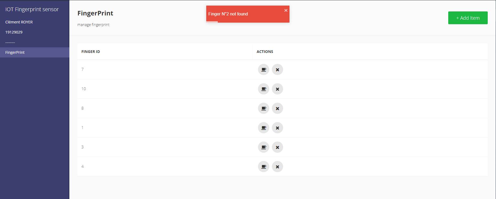

<!-- omit in toc -->
# BJTU Internet of Things

:computer: Clément ROYER - 19129029

<!-- omit in toc -->
##

<!--              -->

<!-- TOC -->
* [Introduction](#introduction)
* [Hardware](#hardware)
* [Software and communication](#software-and-communication)
* [Result](#result)
  * [Front app Explanation](#front-app-explanation)
  * [Front app test](#front-app-test)
  * [Logs adding new finger](#logs-adding-new-finger)
  * [Logs Searching finger](#logs-searching-finger)
* [Issues faced](#issues-faced)
* [Source code](#source-code)
<!-- END TOC -->

<!--                   -->

<!--    -->
<!--    -->
<!--    -->
<!--   
  
  
  
  
  -->

## Introduction

The goal of this final assignment was to create a front web application that displays and/or interact with a sensor. I will present you what sensor did I used, why, and how did I used it. I choose to use a [Fingerprint sensor][product].

I choose a [Fingerprint sensor][product] because it become more and more common on our ever day life, people are starting to see this as a must to have for any security system. I tried to used one to see how difficult it could be to integrate this sensor to any other project, and see what limit it have. The [product] I found make it easy to use. We will details those step later, but with only 3 connection you ended up with a working fingerprint scanner.

<!--   
  
  
  
  
  
  
  
  -->
<!--    -->

## Hardware

For my hardware, I chose to use an [arduino uno](https://www.amazon.fr/Arduino-A000066-M%C3%A9moire-flash-32/dp/B008GRTSV6) and a [Fingerprint sensor][product] from adafruit.com, the connection was really simple. I just had to plug the fingerprint sensor to the pin 0 and 1, to the 3v or 5v power source and it's already ready to use!

Here is an example of wiring (except the pin should be on 0 and 1):

> source : adafruit.com

<!--    -->

## Software and communication

For my software, I decided to use three technologies. The first one was [Python](https://www.python.org/), mainly because it's easy to use and simple to play around with sensors and Arduino. Then I used [Flask](https://palletsprojects.com/p/flask/), to create a web API, and [RESTool](https://github.com/dsternlicht/RESTool) to have good visual.

[RESTool](https://github.com/dsternlicht/RESTool) is an open-source project, that create an easy front web for RESTFUL API. I chose to use it because I didn't have the knowledge and the time to dive into front web development. I felt like this was easier and better than anything I could do in the amount of time we had.

The core of the project is located in this [python file](src/fingerprint.py), I used the [adafruit_fingerprint library](https://github.com/adafruit/Adafruit_CircuitPython_Fingerprint) to easily communicate with the sensor.
And then in this [python file](src/main.py) I used Flask to make the bridge between the front app and the sensor. The front app is located in the folder [build](./build) and made from a react-native, built, and deployed in this repository. You can see and edit its configuration on [this file](build/config.js).

## Result

As a result, I made a front application where you record you finger, try if the finger is already record, delete a finger. Every time you press a button you have to put your finger on the scanner.

### Front app Explanation

### Front app test

### Logs adding new finger

### Logs Searching finger

## Issues faced

* I don't own the sensor, so it's hard to imagine the wiring of the sensor. I faced this issue with the documentation, and use examples of the sensor.
* Because I don't own the sensor and the Arduino UNO, I had to fake my data, to do so I generate a number between 0 and 10 every time you have to scan your finger and the number equal the finger you would have scanned if there was a sensor.
* I'm not a front web developer and don't like web development, I managed to face this issue thanks to an open-source project I'm already using and participating.

  

## Source code

All the code is available [here](https://github.com/ClementRoyer/IoT/blob/master/)

You can start the project by starting the file [start.bat](start.bat)
<!-- links -->

# Clément ROYER - 19129029

[product]: https://www.adafruit.com/product/751
[try-out]: https://learn.adafruit.com/adafruit-optical-fingerprint-sensor?view=all
